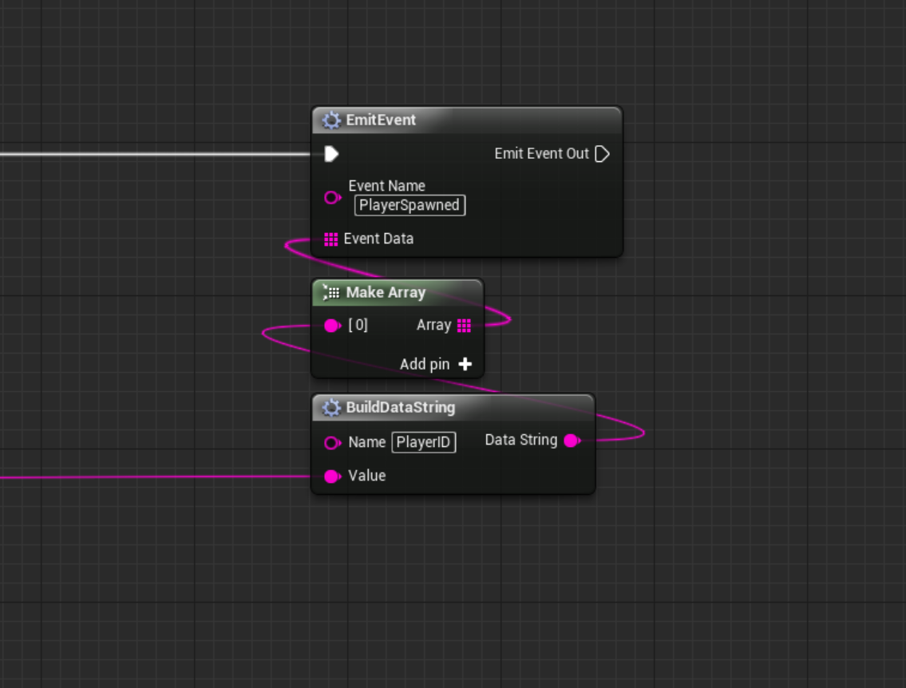

# ark-observer
A simple singleton to use in ARK modding projects that provides Observer Pattern-esque functionality. This is not a true Observer Pattern implementation, but uses many of the same concepts.

This provides a more robust way to pass data between actors in a single mod, or even between multiple mods without the actors using it needing to have references to anything they are passing the data to.

# Setup Instructions

- **Without Git:**
1. Download the `NameValuePair.uasset` and `ObserverSingleton.uasset` files and place them somewhere in your project.
2. Open your `PrimalGameData` file and add `ObserverSingleton` to your list of singleton actors.

- **With Git:**
1. Add this repo as a submodule with the following command: `git submodule add git@github.com:GyozaGuy/ark-observer.git Observer`
2. Run `git submodule init`
3. Run `git submodule update`
4. Open your `PrimalGameData` file and add `ObserverSingleton` to your list of singleton actors.

If using the Git submodule method, you can easily get any future updates I release by simply running `git submodule update`.

# Usage Instructions

You can modify the `ObserverSingleton` directly if you wish, but I recommend leaving it alone and instead referencing it in other graphs to gain access to the methods it provides. This is especially important if you want to easily update it with any updates I release in the future.

There are three methods on the `ObserverSingleton` to be aware of:
1. `EmitEvent` - emits an event that other actors can listen for. You need to specify an event name and any event data you wish to send.
2. `HandleEvent` - takes input from the `ActorCustomEvent` node (available in the ARK Dev Kit) and processes it, returning the event name and event data.
3. `GetData` - takes the event data (previously processed by `HandleEvent`) and a key and returns the event data that corresponds to that key.

## Emitting an Event

To emit an event, the steps are generally as follows:
1. Prepare the data you wish to send.
2. Get a reference to the `ObserverSingleton` actor, and cast it to the `ObserverSingleton` class.
3. Drag off of the cast node, and look for the `EmitEvent` method.
4. Enter an event name directly into the `EmitEvent` node in the appropriate box.
5. Drag off of the `Data` argument on the `EmitEvent` node and look for `Make Array`.
6. Drag off of the input to the `Make Array` node and look for `Make NameValuePair`.
7. Enter your data into the `Make NameValuePair` node. Provide a name to associate with the data (the `key`) and the data itself (the `value`).
8. Repeat steps 6 and 7 for all data you want to add to the event.

## Listening for an Event

To listen for an event, the steps are generally as follows:
1. Get a reference to `GameMode` and cast it to `ShooterGameMode`.
2. Drag off of the cast to `ShooterGameMode` node and look for the `Bind Event to OnActorCustomEvent` node.
3. Drag off of the red method box on the event node and select the option to create a new custom event. Name it whatever you want.
4. Get a reference to the `ObserverSingleton` actor, and cast it to the `ObserverSingleton` class.
5. Drag off of the cast node and look for the `HandleEvent` function.
6. Connect the `Event Custom String` input from the custom event node you created to the `Event String` argument of the `HandleEvent` function.
7. Drag off of the `Event Name` output of the `HandleEvent` function and use a `Switch on String` node to direct execution to different logic depending on the event name.
8. To get the event data corresponding to a specific key, drag off of the output of the `Cast to ObserverSingleton` node and find the `GetData` function.
9. Connect the `Event Data` output of the `HandleEvent` function to the `Event Data` input of the `GetData` function.
10. Enter the key for the data you want into the `Key` argument of the `GetData` function.
11. The `Value` output of the `GetData` function will be the data you requested with the provided `Key` value, assuming it exists in the event data.

# Usage Example

The `ObserverSingleton.uasset` file has a usage example built in, but here is another simple example that will help you understand how to use this.

In this example, a player is given a buff, and we emit an event telling the universe the name of the player (stored as `PlayerID`) that got the buff. Any actors that are set up to listen for it will receive the event and have access to the name of the player.

On the actor that is listening for the event, we get the `PlayerID` data from the event data and print it.

## Emitting an Event

## Listening for an Event

# Things to be aware of

- I recommend emitting events and listening for events on the server to avoid duplication. Handle it however you want to though.
- If you are going to listen for a lot of events, I suggest getting the reference to the `ObserverSingleton` in the `Event Begin Play` logic of your graph and storing it with a variable, then using that variable in the `OnActorCustomEvent` custom event you create to avoid getting the reference more times than you need to. (The same principle applies to emitting events... if you are going to use it a lot in the same graph, get the reference once and store it as a variable.)
- To get a reference to the `ObserverSingleton`, it _should_ be safe to use the `Get All Actors Of Class` method using the `ObserverSingleton` class, then getting the first element of the resulting array. It's a singleton, so only one should exist. Even if other mods use this singleton, it should be safe because in theory all potential `ObserverSingleton` actors in the game should have the exact same methods available for use.
- It is probably a good idea to use a small delay before emitting an event after your mod does something, especially in the case in the example where I'm spawning a buff and then listening for an event on that buff. The delay gives the buff a chance to be created.
